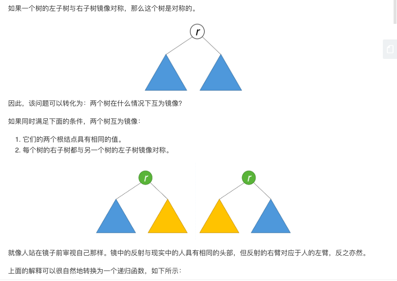

## 题目
给定一个二叉树，检查它是否是镜像对称的。


**示例1**
例如，二叉树 [1,2,2,3,4,4,3] 是对称的。
```
    1
   / \
  2   2
 / \ / \
3  4 4  3
```
但是下面这个 [1,2,2,null,3,null,3] 则不是镜像对称的:
```
    1
   / \
  2   2
   \   \
   3    3
```


## 代码(递归)
```C++
/**
 * Definition for a binary tree node.
 * struct TreeNode {
 *     int val;
 *     TreeNode *left;
 *     TreeNode *right;
 *     TreeNode(int x) : val(x), left(NULL), right(NULL) {}
 * };
 */
class Solution {
public:
    bool isSymmetric(TreeNode* root) {
        if(!root) return true;
        return judge(root->left,root->right);
    }
    
    bool judge(TreeNode* left,TreeNode* right){
        if(!left&&!right) return true;
        else if(left&&right&&left->val==right->val&&judge(left->left,right->right)&&judge(left->right,right->left)) return true;
        else return false;
    }
};
```

## 代码(迭代)
```C++
/**
 * Definition for a binary tree node.
 * struct TreeNode {
 *     int val;
 *     TreeNode *left;
 *     TreeNode *right;
 *     TreeNode(int x) : val(x), left(NULL), right(NULL) {}
 * };
 */
class Solution {
public:
    bool isSymmetric(TreeNode* root) {
        queue<TreeNode*> q;
        q.push(root);
        q.push(root);
        while (!q.empty())
        {
            TreeNode* t1 = q.front();
            q.pop();
            TreeNode* t2 = q.front();
            q.pop();
            if (t1 == NULL && t2 == NULL) continue;
            if (t1 == NULL || t2 == NULL) return false;
            if (t1->val != t2->val) return false;
            q.push(t1->left);
            q.push(t2->right);
            q.push(t1->right);
            q.push(t2->left);
        }
        return true;
    }
};
```


## 思路

### 解法1
这题可以通过递归的方式判断。


### 解法2
除了递归的方法外，我们也可以利用队列进行迭代。队列中每两个连续的结点应该是相等的，而且它们的子树互为镜像。最初，队列中包含的是 root 以及 root。该算法的工作原理类似于 BFS，但存在一些关键差异。每次提取两个结点并比较它们的值。然后，将两个结点的左右子结点按相反的顺序插入队列中。当队列为空时，或者我们检测到树不对称（即从队列中取出两个不相等的连续结点）时，该算法结束。
