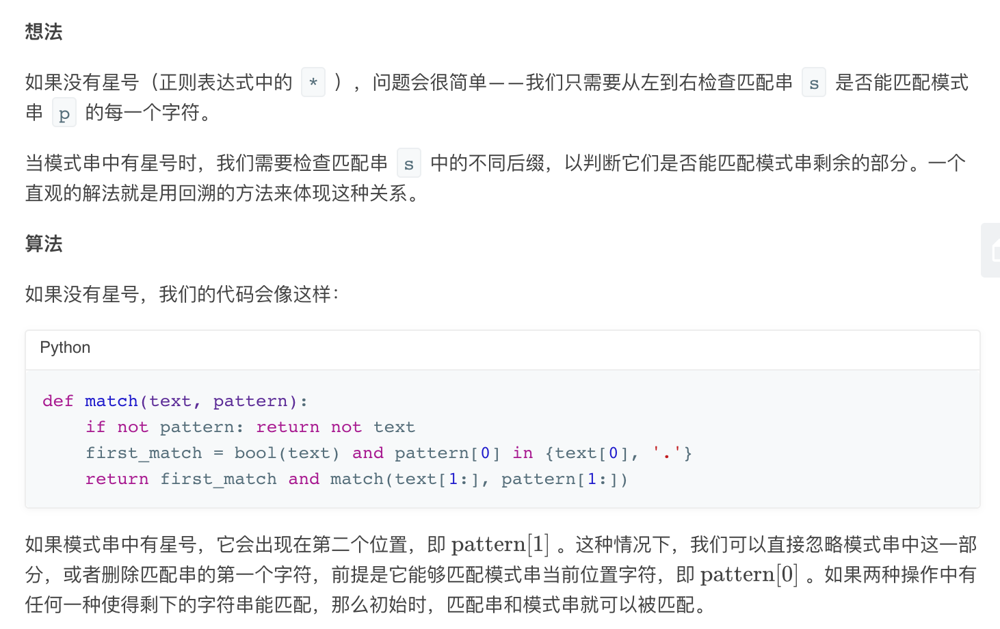

## 题目
给你一个字符串 s 和一个字符规律 p，请你来实现一个支持 '.' 和 '*' 的正则表达式匹配。

```
'.' 匹配任意单个字符
'*' 匹配零个或多个前面的那一个元素
```
所谓匹配，是要涵盖 整个 字符串 s的，而不是部分字符串。

说明:

* s 可能为空，且只包含从 a-z 的小写字母。
* p 可能为空，且只包含从 a-z 的小写字母，以及字符 . 和 *。


**示例1**
```
输入:
s = "aa"
p = "a"
输出: false
解释: "a" 无法匹配 "aa" 整个字符串。
```

**示例2**
```
输入:
s = "aa"
p = "a*"
输出: true
解释: 因为 '*' 代表可以匹配零个或多个前面的那一个元素, 在这里前面的元素就是 'a'。因此，字符串 "aa" 可被视为 'a' 重复了一次。
```

**示例3**
```
输入:
s = "ab"
p = ".*"
输出: true
解释: ".*" 表示可匹配零个或多个（'*'）任意字符（'.'）。
```

**示例4**
```
输入:
s = "aab"
p = "c*a*b"
输出: true
解释: 因为 '*' 表示零个或多个，这里 'c' 为 0 个, 'a' 被重复一次。因此可以匹配字符串 "aab"。
```

**示例5**
```
输入:
s = "mississippi"
p = "mis*is*p*."
输出: false
```

## 代码（回溯）
```JAVA
class Solution {
    public boolean isMatch(String text, String pattern) {
        if(p.isEmpty()) return s.isEmpty();
        boolean headMatch = (!s.isEmpty() && (s.charAt(0) == p.charAt(0) || p.charAt(0) == '.'));
        if(p.length() >= 2 && p.charAt(1) == '*'){
            return isMatch(s,p.substring(2)) || (headMatch && isMatch(s.substring(1),p));
        }
        return headMatch && isMatch(s.substring(1),p.substring(1));
    }
}
```

## 代码（自顶向下dp）
```JAVA
enum Result {
    TRUE, FALSE
}

class Solution {
    Result[][] memo;

    public boolean isMatch(String text, String pattern) {
        memo = new Result[text.length() + 1][pattern.length() + 1];
        return dp(0, 0, text, pattern);
    }

    public boolean dp(int i, int j, String text, String pattern) {
        if (memo[i][j] != null) {
            return memo[i][j] == Result.TRUE;
        }
        boolean ans;
        if (j == pattern.length()){
            ans = (i == text.length());
        } else{
            boolean first_match = (i < text.length() &&
                                   (pattern.charAt(j) == text.charAt(i) ||
                                    pattern.charAt(j) == '.'));

            if (j + 1 < pattern.length() && pattern.charAt(j+1) == '*'){
                ans = dp(i, j+2, text, pattern) ||
                      (first_match && dp(i+1, j, text, pattern));
            } else {
                ans = first_match && dp(i+1, j+1, text, pattern);
            }
        }
        memo[i][j] = ans ? Result.TRUE : Result.FALSE;
        return ans;
    }
}
```

## 代码（自底向上dp）
```JAVA
class Solution {
    public boolean isMatch(String text, String pattern) {
        // 用于保存中间结果
        boolean[][] dp = new boolean[text.length()+1][pattern.length()+1];
        // 将右下角置为true
        //从后往前匹配
        dp[text.length()][pattern.length()] = true;
        // 从后向前匹配
        // i从越界开始补齐了最后一列
        // 由于dp的右下角已经赋值
        // 所以不用重复判断所以j从length-1开始
        for (int i = text.length(); i >= 0; i--) {
            for (int j = pattern.length() - 1; j >= 0; j--) {
                // 判断字符是否相等
                boolean first_match = (i < text.length() &&
                        (pattern.charAt(j) == text.charAt(i) ||
                                pattern.charAt(j) == '.'));
                // 涉及到了*号匹配
                if (j+1 < pattern.length() && pattern.charAt(j+1) == '*'){
                    // 状态转换方程
                    // 若后一个字符为*那么就涉及到了*号匹配
                    // 规律就是看看跳过两个是否匹配（也代表了*号的可以是0个匹配字符的性质）
                    // 或者老老实实匹配*号当前字符是否匹配且j不用改变i继续后移看看是否匹配
                    dp[i][j] = dp[i][j+2] || first_match&&dp[i+1][j];
                }else {
                    // 不涉及*号的匹配
                    // 就看之前的字符是否匹配以及当前字符是否匹配即可
                    dp[i][j] = first_match && dp[i+1][j+1];
                }
            }
        }
        // dp[0][0]就代表着之后的全部匹配完成看看是否全部匹配
        return dp[0][0];
    }
}
```


## 思路

这题没想出来，太菜了。。。下面答案都是看了解答之后才明白的。

### 解法1
回溯法比较自然，但是复杂度会高些。因为会涉及许多重复的计算。



### 解法2和解法3
用dp能够将结果动态构建dp表，避免不必要的计算。在复杂度上会有降低。

