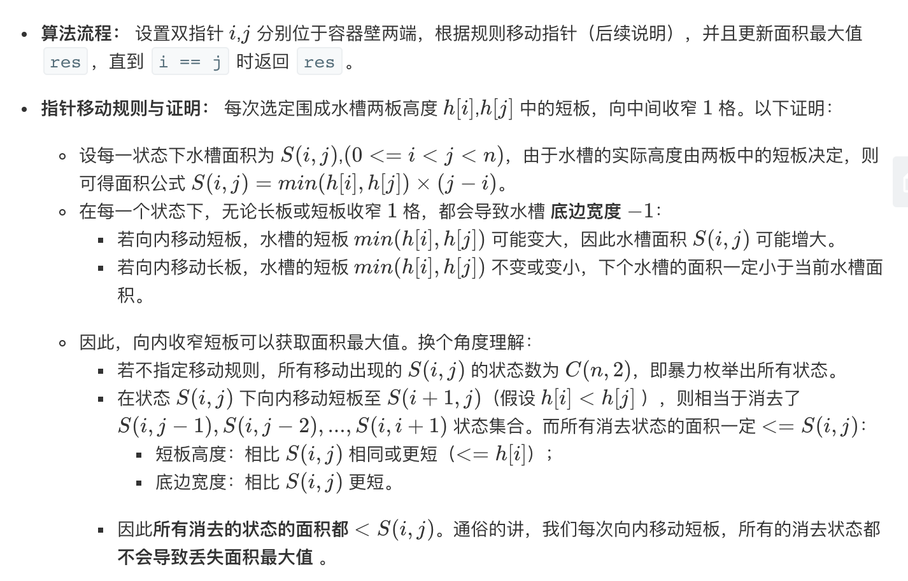

## 题目
给你 n 个非负整数 a1，a2，...，an，每个数代表坐标中的一个点 (i, ai) 。在坐标内画 n 条垂直线，垂直线 i 的两个端点分别为 (i, ai) 和 (i, 0)。找出其中的两条线，使得它们与 x 轴共同构成的容器可以容纳最多的水。

**说明**

* 你不能倾斜容器，且 n 的值至少为 2。


**示例**
```
输入：[1,8,6,2,5,4,8,3,7]
输出：49
```

## 代码（暴力）
```C++
class Solution {
public:
    int maxArea(vector<int>& height) {
        int size = height.size();
        int ans = 0;
        for(int i = 0;i < size;i++)
            for(int j = i + 1;j < size;j++){
                ans = max(ans, min(height[i],height[j]) * (j - i));
            }
        return ans;
    }
};
```

## 代码（双指针贪心）
```C++
class Solution {
public:
    int maxArea(vector<int>& height) {
        int left = 0;
        int right = height.size() - 1;
        int ans = -1;
        while(left < right){
            int area = min(height[left], height[right]) * (right - left);
            ans = max(ans, area);
            if(height[left] < height[right]){
                left++;
            }else{
                right--;
            }
        }
        return ans;
    }
};
```

## 代码（双指针贪心再优化）
```C++
class Solution {
public:
    int maxArea(vector<int>& height) {
        int left = 0;
        int right = height.size() - 1;
        int ans = -1;
        while(left < right){
            int h = min(height[left], height[right]);
            ans = max(ans, h * (right - left));
            while(height[left] <= h && left < right) left++;
            while(height[right] <= h && left < right) right--;
        }
        return ans;
    }
};
```

## 思路

### 解法1

最直接的做法就是暴力做法，但是一般可以再此基础上做一些优化，下面这个[博客](https://leetcode-cn.com/problems/container-with-most-water/solution/bao-li-fa-de-you-hua-ke-yi-de-dao-shuang-zhi-zhen-/)就是优化思路的来源。

* 时间复杂度：O(n^2)
* 空间复杂度：O(1)，使用恒定的空间

### 解法2

可以优化的做法应该是贪心双指针法，就是不容易想出来，学习学习。大致做法如下，具体证明论证可参考此[博客](https://leetcode-cn.com/problems/container-with-most-water/solution/sheng-zui-duo-shui-de-rong-qi-by-leetcode-solution/)



* 时间复杂度：O(n)
* 空间复杂度：O(1)，使用恒定的空间


### 解法3

在第二步的基础上还可以进行一些小优化，即不用每次只挪动一个指针，而可以每次找到合适的指针为止。这个做法很优秀，不过想一次想出来比较难。

* 时间复杂度：O(n)
* 空间复杂度：O(1)，使用恒定的空间
