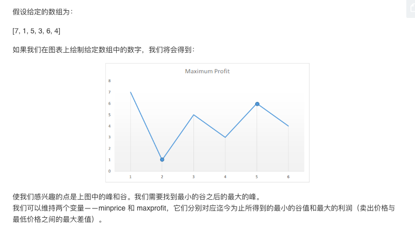

## 题目
给定一个数组，它的第 i 个元素是一支给定股票第 i 天的价格。

如果你最多只允许完成一笔交易（即买入和卖出一支股票），设计一个算法来计算你所能获取的最大利润。

注意你不能在买入股票前卖出股票。

**示例1**
```
输入: [7,1,5,3,6,4]
输出: 5
解释: 在第 2 天（股票价格 = 1）的时候买入，在第 5 天（股票价格 = 6）的时候卖出，最大利润 = 6-1 = 5 。
     注意利润不能是 7-1 = 6, 因为卖出价格需要大于买入价格。
```

**示例2**
```
输入: [7,6,4,3,1]
输出: 0
解释: 在这种情况下, 没有交易完成, 所以最大利润为 0。
```

## 代码
```C++
class Solution {
public:
    int maxProfit(vector<int>& prices) {
        int len = prices.size();
        int min = INT_MAX;
        int max = 0;
        for(int i = 0;i < len;i++){
            if(prices[i] < min)
                min = prices[i];
            else if(max < prices[i] - min)
                max = prices[i] - min;
        }
        return max;
    }
};
```
## 思路

