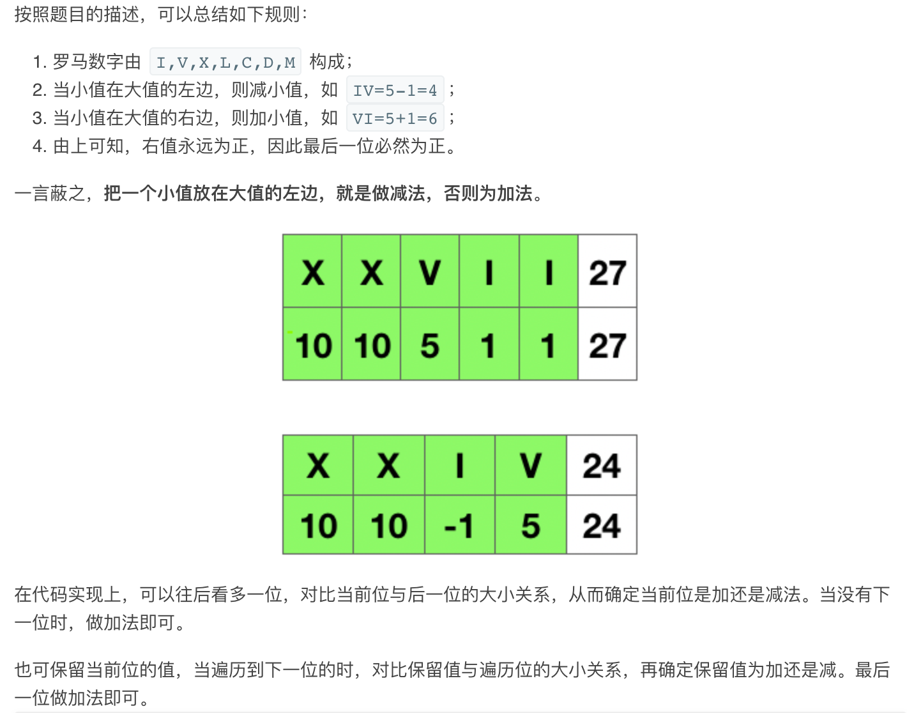

## 题目
罗马数字包含以下七种字符: I， V， X， L，C，D 和 M。
```
字符          数值
I             1
V             5
X             10
L             50
C             100
D             500
M             1000
```
例如， 罗马数字 2 写做 II ，即为两个并列的 1。12 写做 XII ，即为 X + II 。 27 写做  XXVII, 即为 XX + V + II 。

通常情况下，罗马数字中小的数字在大的数字的右边。但也存在特例，例如 4 不写做 IIII，而是 IV。数字 1 在数字 5 的左边，所表示的数等于大数 5 减小数 1 得到的数值 4 。同样地，数字 9 表示为 IX。这个特殊的规则只适用于以下六种情况：

* I 可以放在 V (5) 和 X (10) 的左边，来表示 4 和 9。
* X 可以放在 L (50) 和 C (100) 的左边，来表示 40 和 90。 
* C 可以放在 D (500) 和 M (1000) 的左边，来表示 400 和 900。
给定一个罗马数字，将其转换成整数。输入确保在 1 到 3999 的范围内。

**示例1**
```
输入: "III"
输出: 3
```

**示例2**
```
输入: "IV"
输出: 4
```

**示例3**
```
输入: "IX"
输出: 9
```

**示例4**
```
输入: "LVIII"
输出: 58
解释: L = 50, V= 5, III = 3.
```

**示例5**
```
输入: "MCMXCIV"
输出: 1994
解释: M = 1000, CM = 900, XC = 90, IV = 4.
```

**说明**
所有输入只包含小写字母 a-z 。

## 代码
```C++
class Solution {
    public int romanToInt(String s) { 
        int result = 0;
        int preNum = getValue(s.charAt(0));
        for(int i = 1;i < s.length(); i++) {
            int num = getValue(s.charAt(i));
            if(preNum < num) {
                result -= preNum;
            } else {
                result += preNum;
            }
            preNum = num;
        }
        result += preNum;
        return result;
    }
    private int getValue(char ch) {
        switch(ch) {
            case 'I': return 1;
            case 'V': return 5;
            case 'X': return 10;
            case 'L': return 50;
            case 'C': return 100;
            case 'D': return 500;
            case 'M': return 1000;
            default: return 0;
        }
    }
}
```
## 思路




建议实现时不用hashmap而用switch，这样子空间占用和时间占用都会小很多。