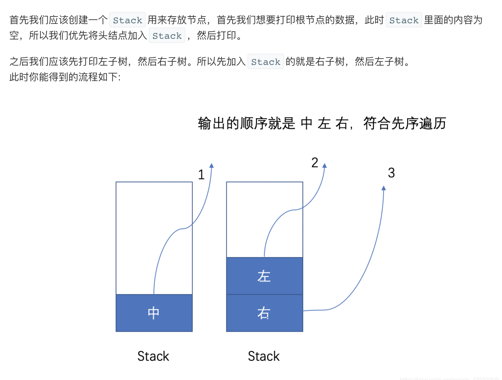

## 题目
给定一个二叉树，返回它的 前序 遍历。

**示例1**
```
输入: [1,null,2,3]  
   1
    \
     2
    /
   3 

输出: [1,2,3]
```

## 代码(递归法)
```C++
/**
 * Definition for a binary tree node.
 * struct TreeNode {
 *     int val;
 *     TreeNode *left;
 *     TreeNode *right;
 *     TreeNode(int x) : val(x), left(NULL), right(NULL) {}
 * };
 */
class Solution {
public:
    vector<int> answer;
    vector<int> preorderTraversal(TreeNode* root) {
        if (root != NULL) {
            answer.push_back(root->val);
            preorderTraversal(root->left);
            preorderTraversal(root->right);
        }
        return answer;
    }
};
```

## 代码(迭代法)
```C++
/**
 * Definition for a binary tree node.
 * struct TreeNode {
 *     int val;
 *     TreeNode *left;
 *     TreeNode *right;
 *     TreeNode(int x) : val(x), left(NULL), right(NULL) {}
 * };
 */
class Solution {
public:
    vector<int> answer;
    vector<int> preorderTraversal(TreeNode* root) {
        if (root != NULL) {
            stack<TreeNode*> s;
            s.push(root);
            while (!s.empty()) {
                TreeNode* node = s.top();
                s.pop();
                answer.push_back(node->val);
                if (node->right != NULL) {
                    s.push(node->right);
                }
                if (node->left != NULL) {
                    s.push(node->left);
                }
            }
        }
        return answer;
    }
};
```


## 思路

### 解法1
使用递归法最简单。

### 解法2
使用迭代法。


其实还有一种Morris做法，空间复杂度最低，但是需要改变树，因此就没写。可以参考此[博客](https://leetcode-cn.com/problems/binary-tree-preorder-traversal/solution/leetcodesuan-fa-xiu-lian-dong-hua-yan-shi-xbian-2/)