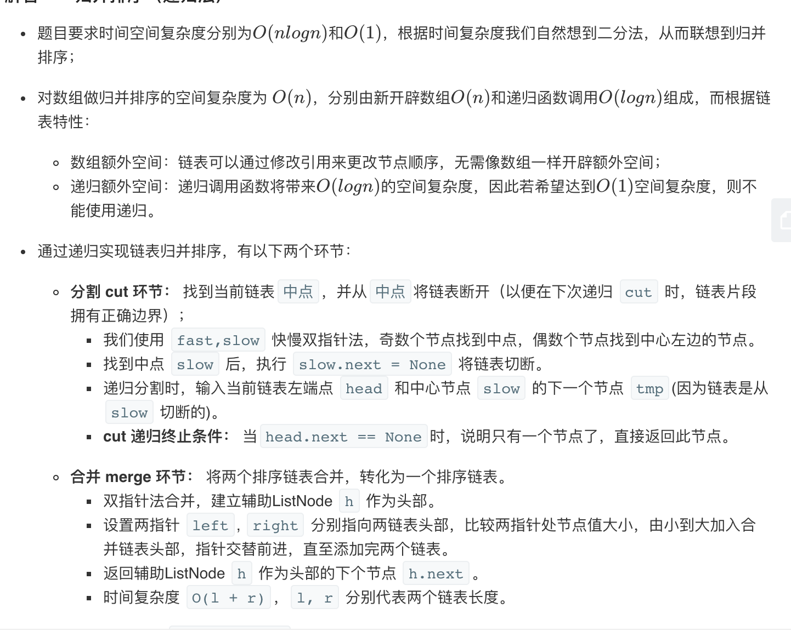

## 题目
在 O(n log n) 时间复杂度和常数级空间复杂度下，对链表进行排序。

**示例1**
```
输入: 4->2->1->3
输出: 1->2->3->4
```

**示例2**
```
输入: -1->5->3->4->0
输出: -1->0->3->4->5
```

## 代码（迭代归并）
```C++
/**
 * Definition for singly-linked list.
 * struct ListNode {
 *     int val;
 *     ListNode *next;
 *     ListNode(int x) : val(x), next(NULL) {}
 * };
 */
class Solution {
public:
    ListNode* sortList(ListNode* head) {
        if(head == NULL || head->next == NULL){
            return head;
        }
        ListNode* fast = head;
        ListNode* slow = head;
        ListNode* sign;
        while(fast && fast->next){
            sign = slow;
            slow = slow -> next;
            fast = fast -> next -> next;
        }
        sign->next = NULL;
        ListNode* right = sortList(slow);
        ListNode* left = sortList(head);
        return mergeTwoLists(left,right);
    }
    
    ListNode* mergeTwoLists(ListNode* l1, ListNode* l2) {
        ListNode* dump = new ListNode(-1);
        ListNode* tmp = dump;
        while(l1 != NULL && l2 != NULL){
            if(l1->val < l2->val){
                tmp->next = l1;
                l1 = l1->next;
            }else{
                tmp->next = l2;
                l2 = l2->next;
            }
            tmp = tmp->next;
        }
        if(l1 != NULL){
            tmp->next = l1;
        }else{
            tmp->next = l2;
        }
        return dump->next;
    }

};
```

## 代码（递归）
```C++
/**
 * Definition for singly-linked list.
 * struct ListNode {
 *     int val;
 *     ListNode *next;
 *     ListNode(int x) : val(x), next(NULL) {}
 * };
 */
class Solution {
public:
    ListNode* sortList(ListNode* head) {
        if(head == NULL || head->next == NULL){
            return head;
        }
        ListNode* fast = head;
        ListNode* slow = head;
        ListNode* sign;
        while(fast && fast->next){
            sign = slow;
            slow = slow -> next;
            fast = fast -> next -> next;
        }
        sign->next = NULL;
        ListNode* right = sortList(slow);
        ListNode* left = sortList(head);
        return mergeTwoLists(left,right);
    }
    
    ListNode* mergeTwoLists(ListNode* l1, ListNode* l2) {
        if(l1 == NULL){
            return l2;
        }else if (l2 == NULL){
            return l1;
        }else{
            if(l1->val < l2->val){
                l1->next = mergeTwoLists(l1->next,l2);
                return l1;
            }else{
                l2->next = mergeTwoLists(l1,l2->next);
                return l2;
            }
        }
    }

};
```

## 思路

具体可参考此[博客](https://leetcode-cn.com/problems/sort-list/solution/sort-list-gui-bing-pai-xu-lian-biao-by-jyd/)

由于这题要求O(nlgn)的复杂度，因此感觉只能通过快排或者归并排序来做。

但是又由于要求O(1)的空间复杂度，所以也不能搞成数组来做，只能穿针引线。

在实现merge时这里给出两种做法，一种是迭代合并，要是有dump节点的话空间复杂度应该不是O(1)，也可以搞成没有dump节点的，那应该就是O(1)了。另一种是递归合并，用了系统栈，感觉空间复杂度好像也不是O(1)...

递归做法。
