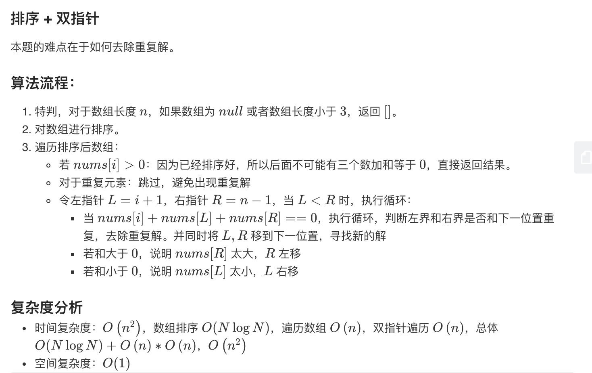

## 题目
给你一个包含 n 个整数的数组 nums，判断 nums 中是否存在三个元素 a，b，c ，使得 a + b + c = 0 ？请你找出所有满足条件且不重复的三元组。

注意：答案中不可以包含重复的三元组。

**示例1**
```
给定数组 nums = [-1, 0, 1, 2, -1, -4]，

满足要求的三元组集合为：
[
  [-1, 0, 1],
  [-1, -1, 2]
]
```

## 代码
```C++
class Solution {
public:
    const int target = 0;
    vector<vector<int>> threeSum(vector<int>& nums) 
    {
        vector<vector<int>> res;
        int N = nums.size();
        if(N < 3){
            return res;
        }
        sort(nums.begin(), nums.end());
        for(int i = 0; i < N - 2; i++)
        {
            if(nums[i] + nums[i + 1] + nums[i + 2] > target)
                break;
            if(i > 0 && nums[i] == nums[i - 1])
                continue;
            int left = i + 1, right = N - 1;
            while(left < right)
            {
                long long sum = (long long)nums[i] + (long long)nums[left] + (long long)nums[right];
                if(sum == target)
                {
                    res.push_back({nums[i], nums[left], nums[right]});
                    while(left < right && nums[left] == nums[left + 1])
                        left++;
                    while(left < right && nums[right] == nums[right - 1])
                        right--;
                    
                    left++;
                    right--;
                }
                else if(sum > target)
                    right--;
                else
                    left++;
            }
            
        }
        return res;
    }
};
```
## 思路

经典题目，方法大致是这样。



实际在写的时候有许多可以优化的小点。

可以参考[博客](https://leetcode-cn.com/problems/3sum/solution/pai-xu-shuang-zhi-zhen-zhu-xing-jie-shi-python3-by/)