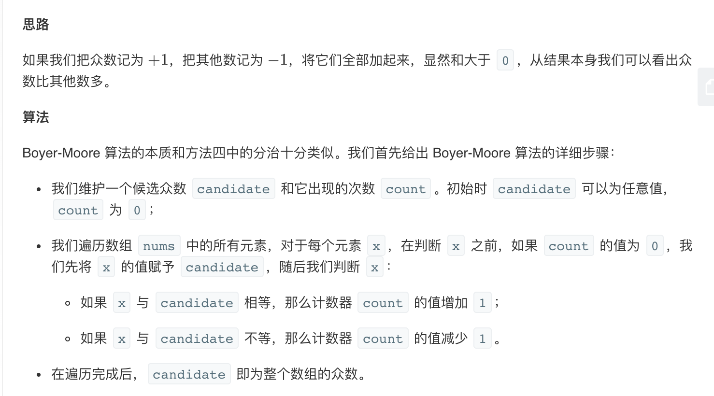

## 题目
给定一个大小为 n 的数组，找到其中的多数元素。多数元素是指在数组中出现次数大于 ⌊ n/2 ⌋ 的元素。

你可以假设数组是非空的，并且给定的数组总是存在多数元素。

**示例1**
```
输入: [3,2,3]
输出: 3
```

**示例2**
```
输入: [2,2,1,1,1,2,2]
输出: 2
```

## 代码(哈希做法)
```C++
class Solution {
public:
    int majorityElement(vector<int>& nums) {
        int len = nums.size();
        unordered_map<int,int> ans;
        for(int num : nums){
            ans[num]++;
        }
        for(auto it = ans.begin(); it != ans.end(); it++){
            if(it->second > len / 2){
                return it->first;
            }
        }
        return 0;
    }
};
```

## 代码(Boyer-Moore 投票算法)
```C++
class Solution {
public:
    int majorityElement(vector<int>& nums) {
        int count = 0;
        int candidate;
        for(int n:nums){
            if(count == 0)
                candidate = n;
            if(n == candidate)
                ++count;
            else
                --count;
        }
        return candidate;
    }
};
```

## 思路

解法比较多，列了最容易想出来的和最优的解法。更多解法可以参考此[博客](https://leetcode-cn.com/problems/majority-element/solution/duo-shu-yuan-su-by-leetcode-solution/)

### 解法1
最简单的做法就是搞个哈希遍历判断一下。

* 时间复杂度：O(N)
* 空间复杂度：O(N)

### 解法2
这个解法不容易证明，但是是最优的。


* 时间复杂度：O(N)
* 空间复杂度：O(1)
