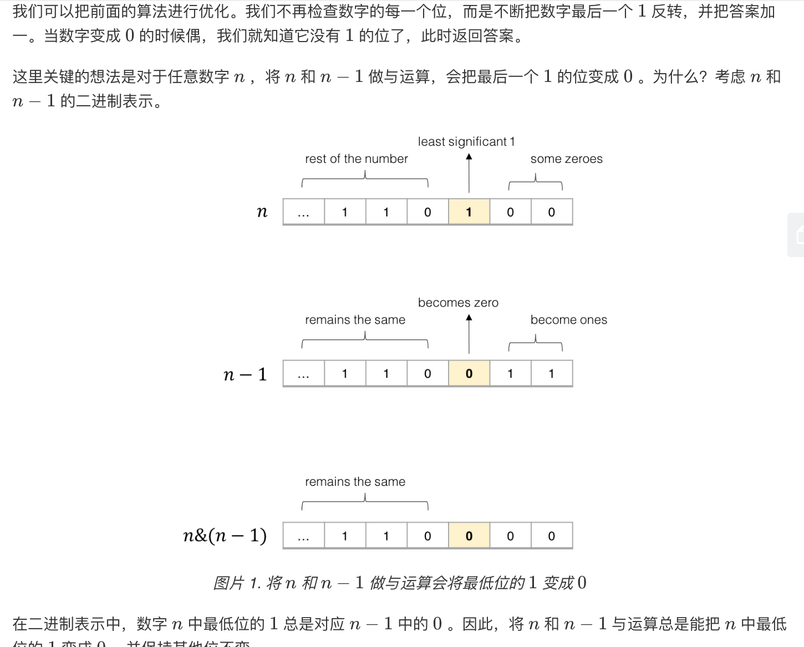

## 题目
编写一个函数，输入是一个无符号整数，返回其二进制表达式中数字位数为 ‘1’ 的个数（也被称为汉明重量）。

**示例1**
```
输入：00000000000000000000000000001011
输出：3
解释：输入的二进制串 00000000000000000000000000001011 中，共有三位为 '1'。
```

**示例2**
```
输入：11111111111111111111111111111101
输出：31
解释：输入的二进制串 11111111111111111111111111111101 中，共有 31 位为 '1'。
```

**示例3**
```
输入：00000000000000000000000010000000
输出：1
解释：输入的二进制串 00000000000000000000000010000000 中，共有一位为 '1'。
```

**提示**
* 请注意，在某些语言（如 Java）中，没有无符号整数类型。在这种情况下，输入和输出都将被指定为有符号整数类型，并且不应影响您的实现，因为无论整数是有符号的还是无符号的，其内部的二进制表示形式都是相同的。
* 在 Java 中，编译器使用二进制补码记法来表示有符号整数。因此，在上面的 示例 3 中，输入表示有符号整数 -3。

**进阶**
* 如果多次调用这个函数，你将如何优化你的算法？

## 代码(位操作)
```C++
class Solution {
public:
    int hammingWeight(uint32_t n) {
        int count = 0;
        while(n != 0){
            if(n % 2 == 1) count++;
            n >>= 1;
        }
        return count;
    }
};
```

## 代码(位操作优化)
```C++
class Solution {
public:
    int hammingWeight(uint32_t n) {
        int count = 0;
        while (n != 0) {
            count++;
            n &= (n - 1);
        }
        return count;
    }
};
```

## 思路

### 解法1
计组的知识，没啥好说的。

* 时间复杂度：O(1)。更详细一点的运行次数依赖于数字 n 在2进制位中最大的1所在的位置。最好为1次，最差为31次。
* 空间复杂度：O(1)。没有使用额外空间。

### 解法2
这个优化比较有意思，虽然都是O(1)但是确实能够减少一些运算。

* 时间复杂度：O(1)。更详细一点的运行次数依赖于数字 n 在2进制位中1的个数。最好为1次，最差为31次。但理论上一定比上面的做法要快。
* 空间复杂度：O(1)。没有使用额外空间。