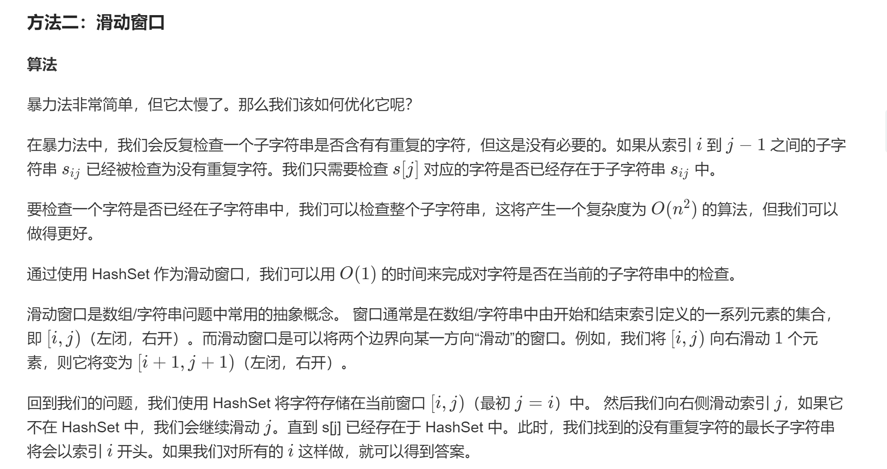

## 题目
给定一个字符串，请你找出其中不含有重复字符的 最长子串 的长度。

**示例1**
```
输入: "abcabcbb"
输出: 3 
解释: 因为无重复字符的最长子串是 "abc"，所以其长度为 3。
```

**示例2**
```
输入: "bbbbb"
输出: 1
解释: 因为无重复字符的最长子串是 "b"，所以其长度为 1。
```

**示例3**
```
输入: "pwwkew"
输出: 3
解释: 因为无重复字符的最长子串是 "wke"，所以其长度为 3。
     请注意，你的答案必须是 子串 的长度，"pwke" 是一个子序列，不是子串。
```

## 代码（暴力）
```JAVA
class Solution {
    public int lengthOfLongestSubstring(String s) {
        int len = s.length();
        int ans = 0;
        for(int i = 0;i < len;i++){
            Set<Character> set = new HashSet<>();
            boolean find = false;
            for(int j = i;j < len;j++){
                if(set.contains(s.charAt(j))){
                    ans = Math.max(ans,j - i);
                    find = true;
                    break;
                }
                set.add(s.charAt(j));
            }
            if(!find){
                ans = Math.max(ans,len - i);
            }
        }
        return ans;
    }
}
```

## 代码（滑动窗口）
```JAVA
class Solution {
    public int lengthOfLongestSubstring(String s) {
        int len = s.length();
        int ans = 0;
        Set<Character> set = new HashSet<>();
        for(int start = 0,end = 0;end < len;){
            if(set.contains(s.charAt(end))){
                set.remove(s.charAt(start++));
            }else{
                set.add(s.charAt(end++));
                ans = Math.max(ans,end - start);
            }
        }
        return ans;
    }
}
```

## 代码（优化滑动窗口）
```JAVA
class Solution {
    public int lengthOfLongestSubstring(String s) {
        int len = s.length();
        int ans = 0;
        Map<Character,Integer> map = new HashMap<>();
        for(int start = 0,end = 0;end < len;end++){
            if(map.containsKey(s.charAt(end))){
                start = Math.max(start,map.get(s.charAt(end)));
            }
            map.put(s.charAt(end),end + 1);
            ans = Math.max(ans,end - start + 1);
        }
        return ans;
    }
}
```

## 思路

###  解法1

这题最直接的做法就是写个双重for循环，然后每次在内部循环的时候搞一个哈希表，遍历判断是否是最长子串，同时记得处理下边界问题，但是这样复杂度太高了，虽然通过了，但是时间排序太靠后了。

看了下其他人有比较高效的做法

###  解法2



###  解法3


