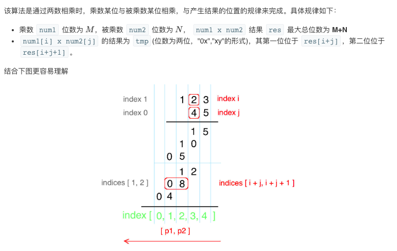

## 题目
给定两个以字符串形式表示的非负整数 num1 和 num2，返回 num1 和 num2 的乘积，它们的乘积也表示为字符串形式。

**示例1**
```
输入: num1 = "2", num2 = "3"
输出: "6"
```

**示例2**
```
输入: num1 = "123", num2 = "456"
输出: "56088"
```

**说明**
* num1 和 num2 的长度小于110。
* num1 和 num2 只包含数字 0-9。
* num1 和 num2 均不以零开头，除非是数字 0 本身。
* 不能使用任何标准库的大数类型（比如 BigInteger）或直接将输入转换为整数来处理。

## 代码(写法1)
```C++
class Solution {
public:
    string multiply(string num1, string num2) {
        if(num1 == "0" || num2 == "0"){
            return "0";
        }
        vector<int> ans(num1.size() + num2.size());
        for(int i = 0;i < num1.size();i++){
            for(int j = 0;j < num2.size();j++){
                ans[i + j + 1] += (num1[i] - '0') * (num2[j] - '0');   
            }
        }
        for(int i = ans.size() - 1;i > 0;i--){
            if(ans[i] > 9){
                ans[i-1] += ans[i] / 10;
                ans[i] %= 10;
            }
        }
        int index = 0;
        while(index < ans.size()){
            if(ans[index] != 0){
                break;
            }
            index++;
        }
        string res;
        for(;index < ans.size();index++){
            res += to_string(ans[index]);
        }
        return res; 
    }
};
```

## 代码(写法2)
```C++
class Solution {
public:
    string multiply(string num1, string num2) {
        if(num1 == "0" || num2 =="0"){
            return "0";
        }
        int len1 = num1.size();
        int len2 = num2.size();
        string res(len1+len2,'0');
        for(int i = len1 - 1;i >= 0;i--){
            int n1 = num1[i] - '0';
            for(int j = len2 - 1;j >= 0;j--){
                int n2 = num2[j] - '0';
                int sum = res[i + j + 1] - '0' + n1 * n2;
                res[i + j] += sum / 10;
                res[i + j + 1] = sum % 10 + '0';
            }
        }
        int index = 0;
        while(index < res.size()){
            if(res[index] != '0'){
                break;
            }   
            index++;
        }
        return res.substr(index);
        
    }
};
```

## 思路

很经典的大数乘法，建议背一下。利用了竖式计算的方法


