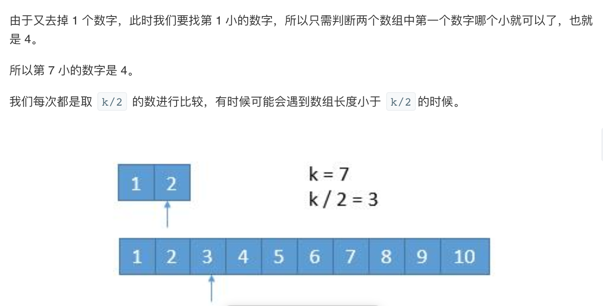

## 题目
给定两个大小为 m 和 n 的有序数组 nums1 和 nums2。

请你找出这两个有序数组的中位数，并且要求算法的时间复杂度为 O(log(m + n))。

你可以假设 nums1 和 nums2 不会同时为空。

**示例1**
```
nums1 = [1, 3]
nums2 = [2]

则中位数是 2.0
```

**示例2**
```
nums1 = [1, 2]
nums2 = [3, 4]

则中位数是 (2 + 3)/2 = 2.5
```

## 代码（暴力合并）
```C++
class Solution {
    public double findMedianSortedArrays(int[] nums1, int[] nums2) {
        int len1 = nums1.length;
        int len2 = nums2.length;
        List<Integer> merge = new ArrayList<>(len1 + len2);
        int count = 0;
        int i = 0;
        int j = 0;
        while(count != (len1 + len2)){
            if(i == len1){
                while(j != len2){
                    merge.add(count++,nums2[j++]);
                }
                break;
            }
            if(j == len2){
                while(i != len1){
                    merge.add(count++,nums1[i++]);
                }
                break;
            }
            if(nums1[i] < nums2[j]){
                merge.add(count++,nums1[i++]);
            }else{
                merge.add(count++,nums2[j++]);
            }
        }
        if(count % 2 == 0)
            return (merge.get(count / 2 - 1) + merge.get(count / 2)) / 2.0;
        else
            return merge.get(count / 2);
        
    }
}
```

## 代码（直接遍历判断）
```C++
class Solution {
    public double findMedianSortedArrays(int[] nums1, int[] nums2) {
        int m = nums1.length;
        int n = nums2.length;
        int len = m + n;
        int left = -1; 
        int right = -1;
        int aStart = 0; 
        int bStart = 0;
        for (int i = 0; i <= len / 2; i++) {
            left = right;
            if (aStart < m && (bStart >= n || nums1[aStart] < nums2[bStart])) {
                right = nums1[aStart++];
            } else {
                right = nums2[bStart++];
            }
        }
        if (len % 2 == 0)
            return (left + right) / 2.0;
        else
            return right;
    }
}
```

## 代码（第K小的数）
```C++
class Solution {
    public double findMedianSortedArrays(int[] nums1, int[] nums2) {
        int len1 = nums1.length; 
        int len2 = nums2.length;
        int totalLength = len1 + len2;
        if (totalLength % 2 == 1) {
            int midIndex = totalLength / 2;
            double median = getKthElement(nums1, nums2, midIndex + 1);
            return median;
        } else {
            int midIndex1 = totalLength / 2 - 1, midIndex2 = totalLength / 2;
            double median = (getKthElement(nums1, nums2, midIndex1 + 1) + getKthElement(nums1, nums2, midIndex2 + 1)) / 2.0;
            return median;
        }
    }

    public int getKthElement(int[] nums1, int[] nums2, int k) {
        /* 主要思路：要找到第 k (k>1) 小的元素，那么就取 pivot1 = nums1[k/2-1] 和 pivot2 = nums2[k/2-1] 进行比较
         * 这里的 "/" 表示整除
         * nums1 中小于等于 pivot1 的元素有 nums1[0 .. k/2-2] 共计 k/2-1 个
         * nums2 中小于等于 pivot2 的元素有 nums2[0 .. k/2-2] 共计 k/2-1 个
         * 取 pivot = min(pivot1, pivot2)，两个数组中小于等于 pivot 的元素共计不会超过 (k/2-1) + (k/2-1) <= k-2 个
         * 这样 pivot 本身最大也只能是第 k-1 小的元素
         * 如果 pivot = pivot1，那么 nums1[0 .. k/2-1] 都不可能是第 k 小的元素。把这些元素全部 "删除"，剩下的作为新的 nums1 数组
         * 如果 pivot = pivot2，那么 nums2[0 .. k/2-1] 都不可能是第 k 小的元素。把这些元素全部 "删除"，剩下的作为新的 nums2 数组
         * 由于我们 "删除" 了一些元素（这些元素都比第 k 小的元素要小），因此需要修改 k 的值，减去删除的数的个数
         */

        int len1 = nums1.length; 
        int len2 = nums2.length;
        int index1 = 0; 
        int index2 = 0;
        int kthElement = 0;

        while (true) {
            // 边界情况
            if (index1 == len1) {
                return nums2[index2 + k - 1];
            }
            if (index2 == len2) {
                return nums1[index1 + k - 1];
            }
            if (k == 1) {
                return Math.min(nums1[index1], nums2[index2]);
            }
            
            // 正常情况
            int half = k / 2;
            int newIndex1 = Math.min(index1 + half, len1) - 1;
            int newIndex2 = Math.min(index2 + half, len2) - 1;
            int pivot1 = nums1[newIndex1];
            int pivot2 = nums2[newIndex2];
            if (pivot1 <= pivot2) {
                k -= (newIndex1 - index1 + 1);
                index1 = newIndex1 + 1;
            } else {
                k -= (newIndex2 - index2 + 1);
                index2 = newIndex2 + 1;
            }
        }
    }
}

```

## 思路

###  解法1

简单粗暴，先将两个数组合并，两个有序数组的合并也是归并排序中的一部分。然后根据奇数，还是偶数，返回中位数。

* 时间复杂度：`O(m + n)`，不满足题意。
* 空间复杂度：`O(m + n)`。

###  解法2

其实，我们不需要将两个数组真的合并，我们只需要找到中位数在哪里就可以了。解法可参考此[博客](https://leetcode-cn.com/problems/median-of-two-sorted-arrays/solution/xiang-xi-tong-su-de-si-lu-fen-xi-duo-jie-fa-by-w-2/)

* 时间复杂度：遍历 `len / 2 + 1` 次，`len = m + n`，所以时间复杂度依旧是 `O(m+n)`，不满足题意。
* 空间复杂度：`O(1)`。

###  解法3





* 时间复杂度：每进行一次循环，我们就减少 k/2 个元素，所以时间复杂度是 `O(log(k))`，而 `k=(m+n)/2`，所以最终的复杂也就是 `O(log(m+n）`。
* 空间复杂度：O(1)。

### 解法4

看到的标准解法，但太烦了，感觉面试的时候想不出来，需要分析的情况太多了，所以弃了。有第三种解法就够了，打扰了。
[二分递归法](https://leetcode-cn.com/problems/median-of-two-sorted-arrays/solution/xun-zhao-liang-ge-you-xu-shu-zu-de-zhong-wei-s-114/)