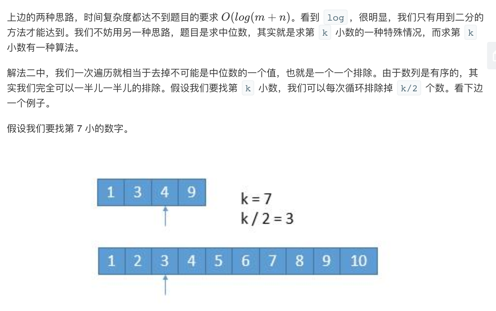
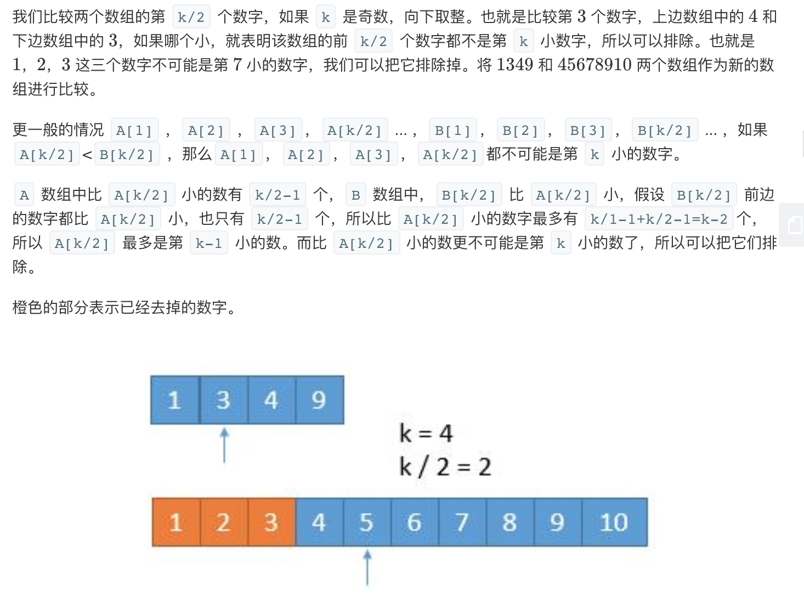
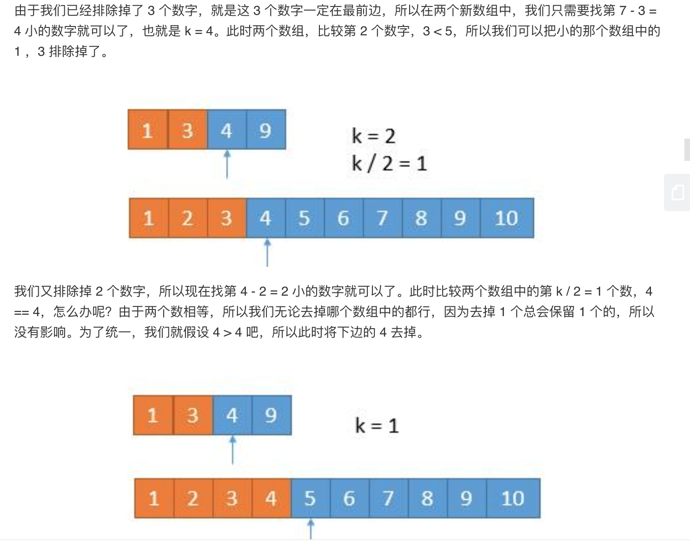
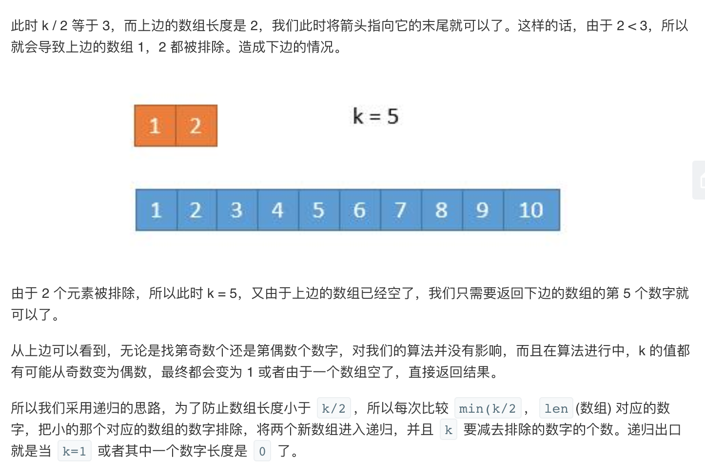

## 题目
给定两个大小为 m 和 n 的有序数组 nums1 和 nums2。

请你找出这两个有序数组的中位数，并且要求算法的时间复杂度为 O(log(m + n))。

你可以假设 nums1 和 nums2 不会同时为空。

**示例1**
```
nums1 = [1, 3]
nums2 = [2]

则中位数是 2.0
```

**示例2**
```
nums1 = [1, 2]
nums2 = [3, 4]

则中位数是 (2 + 3)/2 = 2.5
```

## 代码（暴力合并）
```C++
class Solution {
public:
    double findMedianSortedArrays(vector<int>& nums1, vector<int>& nums2) {
        int m = nums1.size();
        int n = nums2.size();
        vector<int> nums(m + n);
        int count = 0;
        int i = 0, j = 0;
        while (count != (m + n)) {
            if (i == m) {
                while (j != n) {
                    nums[count++] = nums2[j++];
                }
                break;
            }
            if (j == n) {
                while (i != m) {
                    nums[count++] = nums1[i++];
                }
                break;
            }
            if (nums1[i] < nums2[j]) {
                nums[count++] = nums1[i++];
            } else {
                nums[count++] = nums2[j++];
            }
        }
        if (count % 2 == 0) {
            return (nums[count / 2 - 1] + nums[count / 2]) / 2.0;
        } else {
            return nums[count / 2];
        }
    } 
};
```

## 代码（直接遍历判断）
```C++
class Solution {
public:
    double findMedianSortedArrays(vector<int>& nums1, vector<int>& nums2) {
        int m = nums1.size();
        int n = nums2.size();
        int len = m + n;
        int left = -1;
        int right = -1;
        int aStart = 0;
        int bStart = 0;
        for (int i = 0; i <= len / 2; i++) {
            left = right;
            if (aStart < m && (bStart >= n || nums1[aStart] < nums2[bStart])) {
                right = nums1[aStart++];
            } else {
                right = nums2[bStart++];
            }
        }
        if ((len % 2) == 0)
            return (left + right) / 2.0;
        else
            return right;
        }
        
};
```

## 代码（第K小的数）
```C++
class Solution {
public:
    double findMedianSortedArrays(vector<int>& nums1, vector<int>& nums2) {
        int n = nums1.size();
        int m = nums2.size();
        int left = (n + m + 1) / 2;
        int right = (n + m + 2) / 2;
        if ((n + m) % 2 == 1){
            return getKth(nums1, 0, n - 1, nums2, 0, m - 1, left);
        }else{
            return (getKth(nums1, 0, n - 1, nums2, 0, m - 1, left) + getKth(nums1, 0, n - 1, nums2, 0, m - 1, right)) * 0.5;  
        }
    }
    
    int getKth(vector<int>& nums1, int start1, int end1, vector<int>& nums2, int start2, int end2, int k){
        int len1 = end1 - start1 + 1;
        int len2 = end2 - start2 + 1;
        //让 len1 的长度小于 len2，这样就能保证如果有数组空了，一定是 len1 
        if (len1 > len2) return getKth(nums2, start2, end2, nums1, start1, end1, k);
        if (len1 == 0) return nums2[start2 + k - 1];

        if (k == 1) return min(nums1[start1], nums2[start2]);

        int i = start1 + min(len1, k / 2) - 1;
        int j = start2 + min(len2, k / 2) - 1;

        if (nums1[i] > nums2[j]) {
            return getKth(nums1, start1, end1, nums2, j + 1, end2, k - (j - start2 + 1));
        }
        else {
            return getKth(nums1, i + 1, end1, nums2, start2, end2, k - (i - start1 + 1));
        }
    }
};
```

## 思路

###  解法1

简单粗暴，先将两个数组合并，两个有序数组的合并也是归并排序中的一部分。然后根据奇数，还是偶数，返回中位数。

* 时间复杂度：`O(m + n)`，不满足题意。
* 空间复杂度：`O(m + n)`。

###  解法2

其实，我们不需要将两个数组真的合并，我们只需要找到中位数在哪里就可以了。

开始的思路是写一个循环，然后里边判断是否到了中位数的位置，到了就返回结果，但这里对偶数和奇数的分类会很麻烦。当其中一个数组遍历完后，出了 for 循环对边界的判断也会分几种情况。总体来说，虽然复杂度不影响，但代码会看起来很乱。

首先是怎么将奇数和偶数的情况合并一下。

用 len 表示合并后数组的长度，如果是奇数，我们需要知道第 `（len + 1）/ 2` 个数就可以了，如果遍历的话需要遍历 `int(len / 2) + 1` 次。如果是偶数，我们需要知道第 `len / 2` 和 `len / 2 + 1` 个数，也是需要遍历 `len / 2 + 1` 次。所以遍历的话，奇数和偶数都是 `len / 2 + 1` 次。

返回中位数的话，奇数需要最后一次遍历的结果就可以了，偶数需要最后一次和上一次遍历的结果。所以我们用两个变量 left 和 right，right 保存当前循环的结果，在每次循环前将 right 的值赋给 left。这样在最后一次循环的时候，left 将得到 right 的值，也就是上一次循环的结果，接下来 right 更新为最后一次的结果。

循环中该怎么写，什么时候 A 数组后移，什么时候 B 数组后移。用 aStart 和 bStart 分别表示当前指向 A 数组和 B 数组的位置。如果 aStart 还没有到最后并且此时 A 位置的数字小于 B 位置的数组，那么就可以后移了。也就是 `aStart＜m&&A[aStart]< B[bStart]`。

但如果 B 数组此刻已经没有数字了，继续取数字 B[ bStart ]，则会越界，所以判断下 bStart 是否大于数组长度了，这样 || 后边的就不会执行了，也就不会导致错误了，所以增加为 `aStart＜m&&(bStart) >= n||A[aStart]<B[bStart])` 。

* 时间复杂度：遍历 `len / 2 + 1` 次，`len = m + n`，所以时间复杂度依旧是 `O(m+n)`，不满足题意。
* 空间复杂度：`O(1)`。

###  解法3







* 时间复杂度：每进行一次循环，我们就减少 k/2 个元素，所以时间复杂度是 `O(log(k))`，而 `k=(m+n)/2`，所以最终的复杂也就是 `O(log(m+n）`。
* 空间复杂度：虽然我们用到了递归，但是可以看到这个递归属于尾递归，所以编译器不需要不停地堆栈，所以空间复杂度为 O(1)。

### 解法4

看到的标准解法，但太烦了，感觉面试的时候想不出来，需要分析的情况太多了，所以弃了。有第三种解法就够了，打扰了。
[二分递归法](https://leetcode-cn.com/problems/median-of-two-sorted-arrays/solution/xun-zhao-liang-ge-you-xu-shu-zu-de-zhong-wei-shu-b/)


