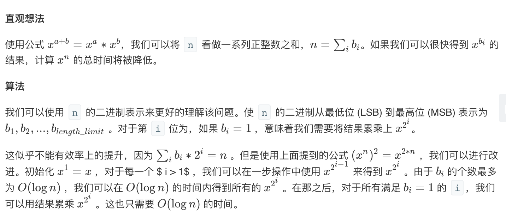

## 题目
实现 pow(x, n) ，即计算 x 的 n 次幂函数。

**示例1**
```
输入: 2.00000, 10
输出: 1024.00000
```

**示例2**
```
输入: 2.10000, 3
输出: 9.26100
```

**示例3**
```
输入: 2.00000, -2
输出: 0.25000
解释: 2-2 = 1/22 = 1/4 = 0.25
```

**说明**
* -100.0 < x < 100.0
* 是 32 位有符号整数，其数值范围是 [−231, 231 − 1] 。

## 代码(暴力)
```C++
class Solution {
public:
    double myPow(double x, int n) {
        long long N = n;
        if (N < 0) {
            x = 1 / x;
            N = -N;
        }
        double ans = 1;
        for (long long i = 0; i < N; i++)
            ans = ans * x;
        return ans;
    }
};
```

## 代码(递归快速幂算法)
```C++
class Solution {
public:
    double myPow(double x, int n) {
        long long int N = n;
        if(N < 0){
            x = 1 / x;
            N = -N;
        }
        return fastPow(x, N);
    }
    double fastPow(double x, long long int n){
        if(n == 0){
            return 1;
        }
        double half = fastPow(x,n / 2); 
        double answer = half * half;
        if(n % 2 == 0){
            return answer;
        }else{
            return answer * x;
        }
    }
};
```

## 代码(迭代快速幂算法)
```C++
class Solution {
public:
    double myPow(double x, int n) {
        long long int N = n;
        if(N < 0){
            x = 1 / x;
            N = -N;
        }
        double ans = 1;
        double current_product = x;
        for (long long i = N; i > 0 ; i /= 2) {
            if ((i % 2) == 1) {
                ans = ans * current_product;
            }
            current_product = current_product * current_product;
        }
        return ans;
    }
};
```

## 思路

### 解法1
这题最简单的就是暴力算法，将x连乘n次，如果 n < 0，我们可以用1 / x，-n来替换x，n。另外我们需关注边界条件，尤其是正整数和负整数的不同范围限制。这种做法的时间复杂度是`O(n)`，肯定不是一个好做法。

### 解法2
其实也可以用快速幂算法，假定我们已经得到了 x ^ (n / 2)的结果，并且我们现在想得到 x ^ n的结果。我们令 A 是 x ^ (n / 2)的结果，我们可以根据 n 的奇偶性来分别讨论 x ^ n的值。
* 如果 n 为偶数，我们可以用公式 (x ^ n) ^ 2 = x ^ (2 * n)来得到 x ^ n = A * A 
* 如果 n 为奇数，那么 A * A = x ^ (n - 1)。直观上看，我们需要再乘一次 x ，即 x ^ n = A * A * x，即 n=A∗A∗x。该方法可以很方便的使用递归实现。我们称这种方法为 "快速幂"。
* 时间复杂度：`O(lgn)`
* 空间复杂度：`O(lgn)`

### 解法3

* 时间复杂度：`O(lgn)`
* 空间复杂度：`O(1)`