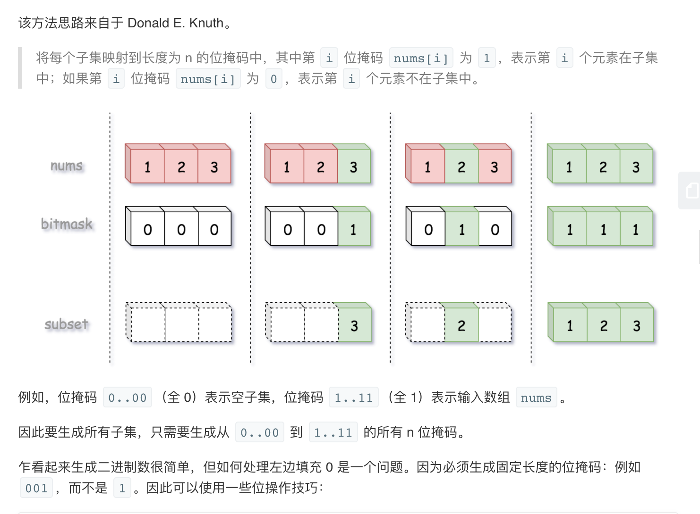

## 题目
给定一组不含重复元素的整数数组 nums，返回该数组所有可能的子集（幂集）。

说明：解集不能包含重复的子集。

**示例1**
```
输入: nums = [1,2,3]
输出:
[
  [3],
  [1],
  [2],
  [1,2,3],
  [1,3],
  [2,3],
  [1,2],
  []
]
```

## 代码(经典密码学)
```C++
class Solution {
public:
    vector<vector<int>> subsets(vector<int>& nums) {
        vector<vector<int>> res;
        int len = nums.size();
        int index = 0;
        int limit = 1 << len;
        while(index < limit) {
            int tmp = index++;
            vector<int> ans;
            for(int i = 0;i < len;i++){
                if(index & (1 << i)){
                    ans.push_back(nums[i]);
                }
            }
            res.push_back(ans);
        }
        return res;
    }
};
```

## 思路

这个解法之前和某位学长讨论过，据说是他去MSRA面试时出的面试题，感觉这个解法非常牛逼，就记下来了。十分巧妙，建议背背。




其他解法懒得写了，可以参考官方[博客](https://leetcode-cn.com/problems/subsets/solution/zi-ji-by-leetcode/)