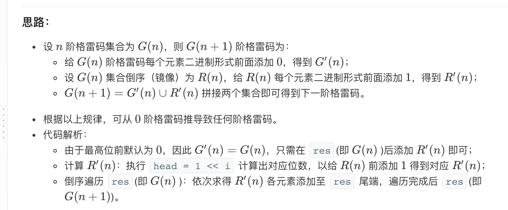

## 题目
格雷编码是一个二进制数字系统，在该系统中，两个连续的数值仅有一个位数的差异。

给定一个代表编码总位数的非负整数 n，打印其格雷编码序列。即使有多个不同答案，你也只需要返回其中一种。

格雷编码序列必须以 0 开头。

**示例1**
```
输入: 2
输出: [0,1,3,2]
解释:
00 - 0
01 - 1
11 - 3
10 - 2

对于给定的 n，其格雷编码序列并不唯一。
例如，[0,2,3,1] 也是一个有效的格雷编码序列。

00 - 0
10 - 2
11 - 3
01 - 1
```

**示例2**
```
输入: 0
输出: [0]
解释: 我们定义格雷编码序列必须以 0 开头。
     给定编码总位数为 n 的格雷编码序列，其长度为 2n。当 n = 0 时，长度为 20 = 1。
     因此，当 n = 0 时，其格雷编码序列为 [0]。
```

## 代码
```C++
class Solution {
public:
    vector<int> grayCode(int n) {
        vector<int> res = {0};
        int head = 1;
        for(int i = 0;i < n;i++){
            for(int j = res.size() - 1; j >= 0; j--){
                res.push_back(head + res[j]);
            }
            head <<= 1;
        }
        return res;
    }
};
```

## 思路

类似于自底向上构建，者到这个规律即可。
