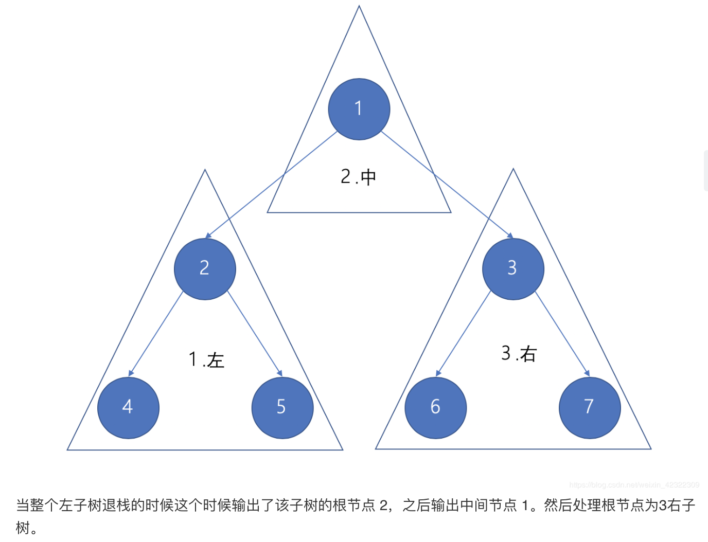

## 题目
给定一个二叉树，返回它的中序 遍历。

**示例1**
```
输入: [1,null,2,3]
   1
    \
     2
    /
   3

输出: [1,3,2]
```

**说明**

* 进阶: 递归算法很简单，你可以通过迭代算法完成吗？

## 代码(系统栈遍历)
```C++
/**
 * Definition for a binary tree node.
 * struct TreeNode {
 *     int val;
 *     TreeNode *left;
 *     TreeNode *right;
 *     TreeNode(int x) : val(x), left(NULL), right(NULL) {}
 * };
 */
class Solution {
public:
    vector<int> ans;
    vector<int> inorderTraversal(TreeNode* root) {
        if(root){
            inorderTraversal(root->left);
            ans.push_back(root->val);
            inorderTraversal(root->right);
        }
        return ans;
    }
};
```

## 代码(显式栈遍历)
```C++
/**
 * Definition for a binary tree node.
 * struct TreeNode {
 *     int val;
 *     TreeNode *left;
 *     TreeNode *right;
 *     TreeNode(int x) : val(x), left(NULL), right(NULL) {}
 * };
 */
class Solution {
public:
    vector<int> inorderTraversal(TreeNode* root) {
        vector<int> ans;
        if(!root){
           return ans;
        }
        stack<TreeNode*> data;
        while(root || !data.empty()){
            while(root){
                data.push(root);
                root = root->left;
            }
            root = data.top();
            ans.push_back(root->val);
            data.pop();
            root = root->right;
        }
        return ans;
    }
};
```


## 思路

### 解法1
递归法

### 解法2
迭代法
1. 创建一个Stack，然后按 左 中 右的顺序输出节点。
2. 尽可能的将这个节点的左子树压入Stack，此时栈顶的元素是最左侧的元素，其目的是找到一个最小单位的子树(也就是最左侧的一个节点)，并且在寻找的过程中记录了来源，才能返回上层，同时在返回上层的时候已经处理完毕左子树了。。
3. 当处理完最小单位的子树时，返回到上层处理了中间节点。（如果把整个左中右的遍历都理解成子树的话，就是处理完 左子树->中间(就是一个节点)->右子树）
4. 如果有右节点，其也要进行中序遍历。
