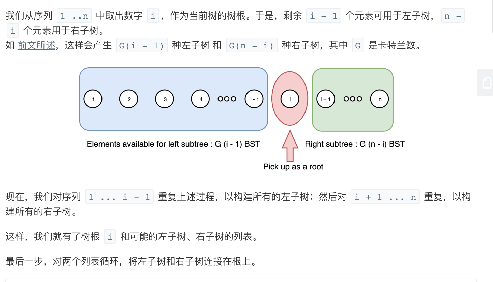

## 题目
给定一个整数 n，生成所有由 1 ... n 为节点所组成的二叉搜索树。

**示例1**
```
输入: 3
输出:
[
  [1,null,3,2],
  [3,2,null,1],
  [3,1,null,null,2],
  [2,1,3],
  [1,null,2,null,3]
]
解释:
以上的输出对应以下 5 种不同结构的二叉搜索树：

   1         3     3      2      1
    \       /     /      / \      \
     3     2     1      1   3      2
    /     /       \                 \
   2     1         2                 3
```

## 代码(递归)
```C++
/**
 * Definition for a binary tree node.
 * struct TreeNode {
 *     int val;
 *     TreeNode *left;
 *     TreeNode *right;
 *     TreeNode(int x) : val(x), left(NULL), right(NULL) {}
 * };
 */
class Solution {
public:
    vector<TreeNode*> generateTrees(int n) {
        if(n == 0) return {};
        return getSubTrees(1, n);
    }
    
    vector<TreeNode*> getSubTrees(int start, int end){
        if(start > end){
            return {NULL};
        }
        if(start == end){
            return {new TreeNode(start)};
        }
        vector<TreeNode*> ans;
        for(int i = start;i <= end;i++){
            vector<TreeNode*> leftTrees = getSubTrees(start, i - 1);
            vector<TreeNode*> rightTrees = getSubTrees(i + 1, end);
            for(auto left : leftTrees){
                for(auto right : rightTrees){
                    TreeNode* root = new TreeNode(i);
                    root->left = left;
                    root->right = right;
                    ans.push_back(root);
                }
            }
        }
        return ans;
    }
};
```

## 思路

递归比较自然



还有一些比如动规的其他做法，可以参考此[博客](https://leetcode-cn.com/problems/unique-binary-search-trees-ii/solution/xiang-xi-tong-su-de-si-lu-fen-xi-duo-jie-fa-by-2-7/)